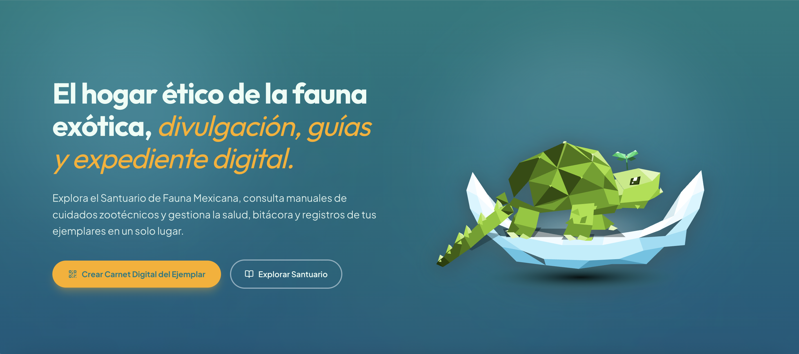
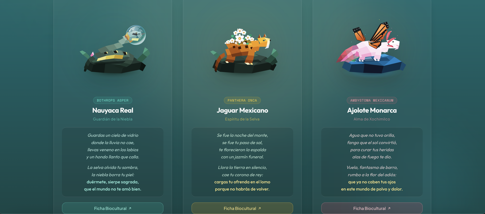
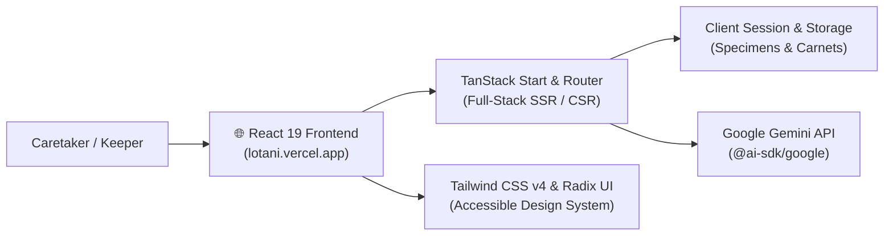
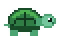

# LOTANI

**AI-assisted digital sanctuary, zootechnical health records, and legal wildlife traceability platform.**

<kbd>React 19</kbd> &nbsp; <kbd>TypeScript</kbd> &nbsp; <kbd>TanStack Start</kbd> &nbsp; <kbd>Tailwind CSS v4</kbd> &nbsp; <kbd>Google Gemini AI</kbd> &nbsp; <kbd>Radix UI</kbd>

<br />

[🌐 Live Platform](https://lotani.vercel.app/) &nbsp;•&nbsp;
[Overview](#-overview) &nbsp;•&nbsp;
[Key Features](#-key-features) &nbsp;•&nbsp;
[Architecture](#-architecture--stack) &nbsp;•&nbsp;
[Quickstart](#-quickstart)

---

> [!IMPORTANT]
> **Ethical exotic wildlife keeping requires rigorous microclimate management and strict legal provenance.**  
> In Latin America, owners face fragmented zootechnical information and lack centralized digital tools to record specimen health and verify legal origin (SEMARNAT / UMA / PIMVS). **LOTANI** unifies these needs into a full-stack platform: pairing immutable digital health records (carnets) and legal provenance tracking with a real-time AI zootechnical assistant powered by Google Gemini.

---

## ↳ Live Showcase

<div align="center">
  
</div>

<br />

<p align="center">
  
  &nbsp;
  
</p>

<p align="center">
  <a href="https://lotani.vercel.app/">
    <b>🚀 Visit the live application: lotani.vercel.app</b>
  </a>
</p>

---

## ↳ Overview

**LOTANI** provides an integrated ecosystem for reptile, amphibian, and arthropod keepers, breeders, and conservationists:

1. **Digital Health Carnet:** Track growth metrics (weight curves), shedding cycles (ecdysis), preventative medical schedules, and clinical histories per specimen.
2. **Legal Provenance Verification:** Store and organize legal documentation conforming to Mexican environmental standards (UMA, PIMVS, legal purchase invoices, and registration tags).
3. **AI Zootechnical Advisory:** On-demand expert guidance using Google Gemini API to analyze habitat parameters, thermal gradients, nutritional requirements, and illness indicators.
4. **Interactive Species Catalog:** Illustrated biocultural guides detailing native Mexican and global exotic biodiversity.

### 🛡️ Platform Capabilities
- [x] **Specimen Lifecycle Tracking**: Continuous weight logs, feeding schedules, and shedding timelines
- [x] **Legal Origin Ledger**: Document records conforming to SEMARNAT / UMA regulatory requirements
- [x] **AI Diagnostic Assistant**: Real-time natural language consultation powered by Google Gemini API
- [x] **Microclimate Engine**: Precise parameters for basking/cool zones, UVB index, and humidity gradients
- [x] **Reactive Client Session**: Local session persistence and role management (Keeper / Breeder)

---

## ↳ Key Features

| Feature | Description | Target Benefit |
| :--- | :--- | :--- |
| **Digital Carnet** | Comprehensive medical log with weight history and shedding cycles | Eliminates paper records and prevents chronic husbandry oversights |
| **Zootechnical Guides** | Interactive species sheets with photoperiod, temperature, and diet | Provides validated scientific standards for reptile and amphibian habitats |
| **Gemini AI Consultant** | Context-aware generative advisory powered by Google Gemini API | Instant answers to emergency husbandry and dietary questions |
| **Legal Compliance Hub** | Repository for UMA/PIMVS registration numbers and official invoices | Fosters ethical trade and combats illegal wildlife trafficking |
| **Adoption & Marketplace** | Responsible specimen transfers and status tracking flows | Connects verified legal keepers with prospective caretakers |

---

## ↳ Architecture & Stack



```text
LOTANI/
├── src/
│   ├── routes/
│   │   ├── index.tsx               # Landing portal and platform showcase
│   │   ├── explorar.tsx            # Specimen directory and sanctuary explorer
│   │   ├── ejemplar.$id.tsx        # Specimen detail, photos, and microclimate
│   │   ├── guias.tsx               # Zootechnical care sheets and husbandry parameters
│   │   ├── legalidad.tsx           # Mexican legal regulatory framework (SEMARNAT / UMA)
│   │   ├── verificacion.tsx        # Legal document verification workflows
│   │   ├── publicar.tsx            # Specimen registration and documentation upload
│   │   ├── perfil.tsx              # User dashboard, digital carnets, and specimen collection
│   │   ├── checkout.$id.tsx        # Adoption and transfer request pipeline
│   │   └── api/                    # Server-side API endpoints (Gemini integration)
│   ├── components/                 # Reusable Radix UI & custom component library
│   ├── hooks/                      # Custom React hooks (auth, store, queries)
│   └── lib/                        # Session storage, data constants, and AI clients
├── docs/images/                    # Production interface screenshots
├── bun.lock                        # Reproducible dependency lockfile
├── package.json                    # Application metadata and scripts
├── vite.config.ts                  # Vite build and plugin configuration
└── LICENSE                         # MIT open source license
```

---

## ↳ Quickstart

### Prerequisites
* **Node.js** 18+ or **Bun** (recommended)
* **Git**
* **Google Gemini API Key** (from [Google AI Studio](https://aistudio.google.com/))

### Local Setup

```bash
# 1. Clone the repository
git clone https://github.com/josiasemm/Lotani.git
cd Lotani

# 2. Install dependencies (Bun or npm)
npm install
# or: bun install

# 3. Configure environment variables
cp .env.example .env.local
```

### Environment Variables (`.env.local`)
```ini
GEMINI_API_KEY=your_google_gemini_api_key
```

### Run Development Server
```bash
bun run dev
# or: npm run dev
```

The application will be available locally at `http://localhost:3000` (or Vite default port `http://localhost:5173`).

---

## ↳ Production Deployment

The web application is deployed continuously on the **Vercel Edge Network**:

```bash
bun run build
# Ready for zero-config Vercel deployment
```

Explore the live production deployment: **[lotani.vercel.app](https://lotani.vercel.app/)**

---

## ↳ License

Distributed under the MIT License. See [LICENSE](LICENSE) for details.

<br />

<div align="center">
  
</div>
